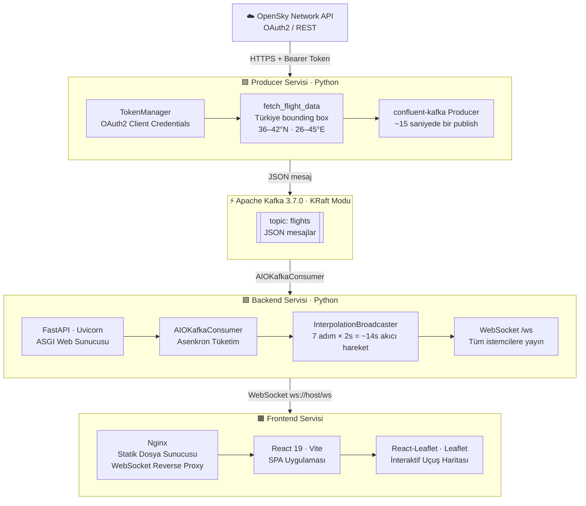

# Realtime Flight Tracker ✈️

Gerçek zamanlı uçuş takip sistemi — OpenSky Network API üzerinden Türkiye hava sahasındaki uçuş verilerini çekerek interaktif bir harita üzerinde anlık olarak görselleştirir.

---

## Mimari



### Veri Akışı

```
OpenSky API → Producer → Kafka (topic: flights) → FastAPI Consumer
    → Interpolation Broadcaster (her 2s) → WebSocket → Nginx Proxy → React/Leaflet
```

> **Interpolasyon:** OpenSky verileri ~15 saniyede bir güncellenir. Backend, iki ardışık batch arasında 7 adım × 2 saniyelik lineer interpolasyon uygulayarak uçakların haritada zıplamak yerine akıcı hareket etmesini sağlar.

---

## Teknoloji Yığını

| Katman | Teknoloji | Açıklama |
|---|---|---|
| **Veri Kaynağı** | OpenSky Network API | Türkiye bounding box (36–42°N, 26–45°E) |
| **Kimlik Doğrulama** | OAuth2 Client Credentials | Token otomatik yenileme (TokenManager) |
| **Mesaj Kuyruğu** | Apache Kafka 3.7.0 (KRaft) | ZooKeeper gerektirmez, tek node |
| **Producer** | Python + confluent-kafka | REST polling → Kafka publish |
| **Backend** | FastAPI + Uvicorn | Async ASGI, WebSocket yayını |
| **Kafka Consumer** | aiokafka | Asenkron tüketim |
| **Frontend** | React 19 + Vite | SPA, modül tabanlı build |
| **Harita** | Leaflet + React-Leaflet | İnteraktif uçuş haritası |
| **Web Sunucusu** | Nginx (Alpine) | Statik dosya + WebSocket reverse proxy |
| **Konteynerizasyon** | Docker + Docker Compose | 4 servis, izole ağ |
| **Ortam Yönetimi** | python-dotenv | `.env` tabanlı gizli değişkenler |
| **Kod Kalitesi** | ESLint | React hooks ve refresh kuralları |

---

## Proje Yapısı

```
realtime_flight_tracker/
├── docker-compose.yml       # 4 servis: kafka, backend, producer, frontend
├── Dockerfile               # Backend + Producer ortak image (Python 3.12-slim)
├── main.py                  # FastAPI uygulaması — Kafka consumer + WebSocket yayını
├── producer.py              # OpenSky polling + Kafka producer
├── requirements.txt         # Python bağımlılıkları
├── .env                     # API kimlik bilgileri (git'e eklenmez)
└── frontend/
    ├── Dockerfile           # 2 aşamalı build: Node.js builder → Nginx:alpine
    ├── nginx.conf           # / statik + /ws WebSocket proxy
    ├── vite.config.js
    ├── package.json
    └── src/
        ├── App.jsx          # Ana uygulama bileşeni
        └── main.jsx
```

---

## Kurulum ve Çalıştırma

### Ön Gereksinimler

- [Docker](https://www.docker.com/) ve Docker Compose
- [OpenSky Network](https://opensky-network.org/) hesabı (API erişimi için)

### 1. Ortam Değişkenlerini Ayarla

Proje kök dizininde `.env` dosyası oluştur:

```env
OPENSKY_CLIENT_ID=your_client_id
OPENSKY_CLIENT_SECRET=your_client_secret
```

### 2. Tüm Servisleri Başlat

```bash
docker compose up --build
```

Bu komut sırasıyla şu servisleri başlatır:
1. **Kafka** — sağlık kontrolü geçene kadar beklenir
2. **Producer** — OpenSky'dan veri çekmeye başlar
3. **Backend** — Kafka'yı dinler, WebSocket bağlantılarını kabul eder
4. **Frontend** — `http://localhost` üzerinden erişilebilir

### 3. Uygulamaya Eriş

Tarayıcıda `http://localhost` adresini aç.

---

## Servisler ve Portlar

| Servis | Port | Açıklama |
|---|---|---|
| Frontend (Nginx) | `80` | React uygulaması + WS proxy |
| Backend (FastAPI) | `8000` | Yalnızca iç ağda (Docker) |
| Kafka | `9092` | Yalnızca iç ağda (Docker) |

---

## WebSocket Protokolü

Frontend, `ws://<host>/ws` adresine bağlanır. Backend her 2 saniyede bir aşağıdaki formatta JSON dizisi yayınlar:

```json
[
  ["icao24", callsign, origin_country, ..., longitude, latitude, altitude, ...],
  ...
]
```

Her eleman [OpenSky State Vector](https://openskynetwork.github.io/opensky-api/rest.html#response) formatındadır.

---

## Geliştirme (Lokal)

```bash
# Python sanal ortamı
python -m venv .venv
source .venv/bin/activate
pip install -r requirements.txt

# Frontend
cd frontend
npm install
npm run dev
```

Lokal geliştirmede Kafka için `docker compose up kafka` ile sadece Kafka servisini ayağa kaldırabilirsin.

---

## Lisans

MIT

